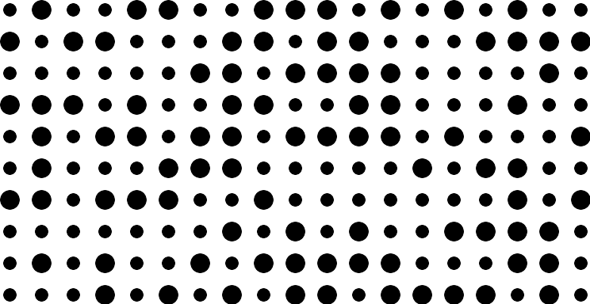
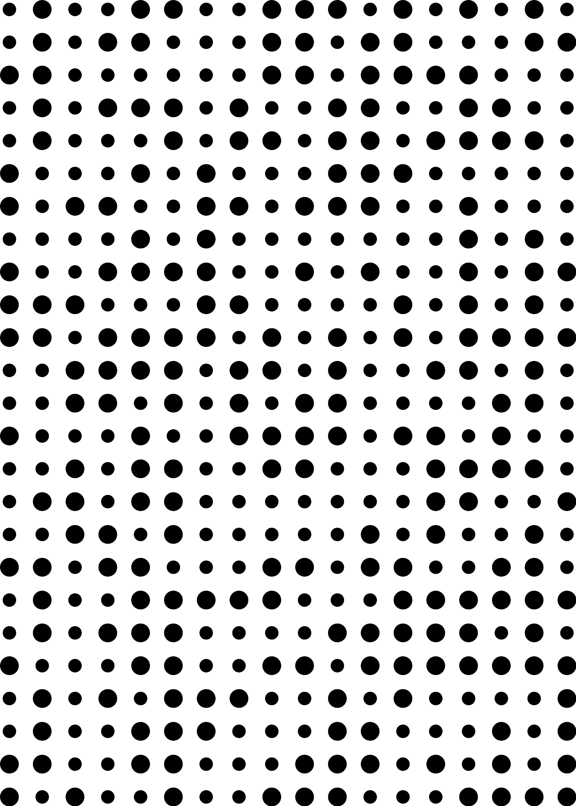
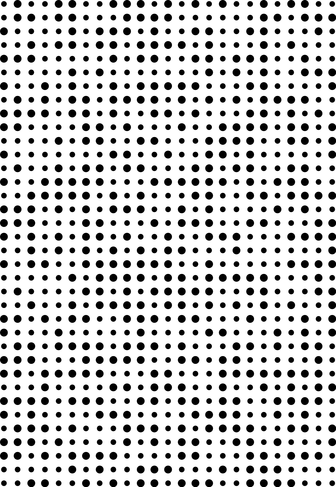
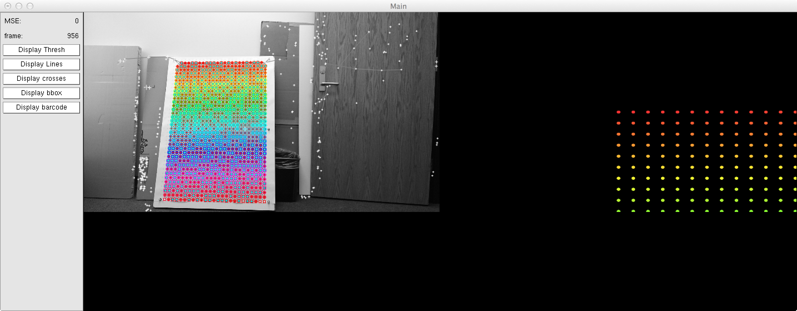
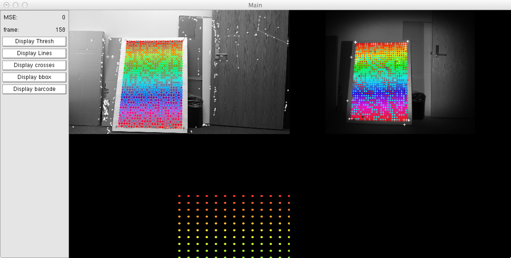
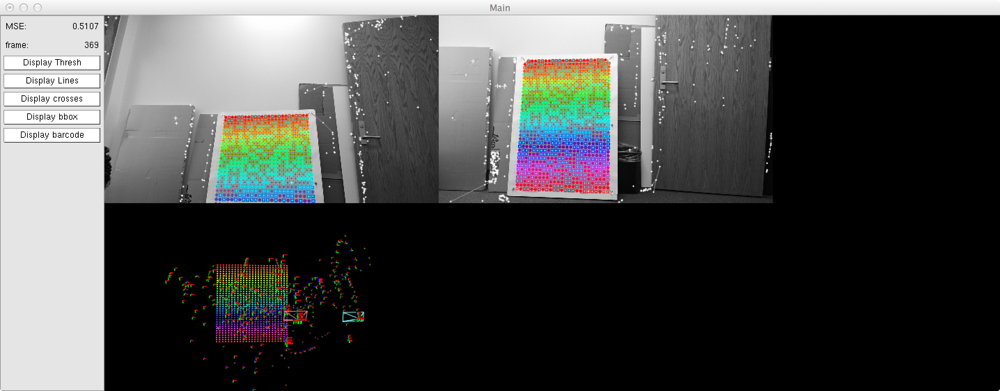

Calibration
===========

Guidelines for visual (RGB), infrared and visual-inertia calibration with [Vicalib](https://github.com/arpg/vicalib).

To calibrate a device, you need to

1. build a physical calibration pattern (you need a printer and some rigid board) and
2. capture a video sequence of the pattern with the camera to calibrate.

You can calibrate a single camera to obtain its intrinsic parameters, or several cameras at the same time to obtain their intrinsic parameters and their relative poses. You can use any camera or device that is supported by [HAL](https://github.com/arpg/HAL).

## Building a calibration pattern

There are three main calibration patterns: a small one that fits an A4 or Letter size sheet of paper, a medium-sized one that fits a Arch D sheet of paper (2 x 3 feet, 610 x 914 mm) and a large one that fits an Arch E sheet of paper (3 x 4 feet, 914 x 1219 mm). The small one is suitable to calibrate a single camera or several cameras that are close each other. The medium and large ones are suitable for larger spaces.

### Creating a small pattern

You can create a SVG or EPS file with the design of the small pattern with Vicalib:

     ./vicalib -grid_preset small -output_pattern_file pattern.svg
     I1022 10:39:34.678490 1938174736 vicalib-engine.cc:329] File pattern.svg saved

This produces an image like this, where the distance between circles is 14.11mm:



### Creating a medium pattern

You can create a SVG or EPS file with the design of the medium pattern with Vicalib:

     ./vicalib -grid_preset medium -output_pattern_file pattern.svg
     I1022 10:39:34.678490 1938174736 vicalib-engine.cc:329] File pattern.svg saved

This produces an image like this, where the distance between circles is 31.56mm:



### Creating a large pattern

You can create a SVG or EPS file with the design of the large pattern with Vicalib:

    $ ./vicalib -grid_preset large -output_pattern_file pattern.svg
    I1022 10:39:34.678490 1938174736 vicalib-engine.cc:329] File pattern.svg saved

This produces an image like this, where the distance between circles is 31.56mm:



### Printing a pattern

Print the calibration pattern in its actual size. It is very important to deactivate any scaling option in the printer dialog.

You can convert a vector SVG image into a rasterized PDF with ImageMagick:

    $ convert -density 300 pattern.svg pattern.pdf

Attach the sheet of paper to a planar, rigid and thick surface, such as a piece of foam board or balsa wood. If the balsa board is thin, you can glue it to a thicker board to avoid blending. Spray glue over a Gator Board are recommended.

## Calibrating a camera

To calibrate a camera, call `vicalib` with the grid preset corresponding to your pattern and the desired camera in the HAL driver format: `vicalib -grid_preset <preset> -cam <driver>`.

After capturing some images with the pattern, start the optimization by pressing the key `[`.

When done, Vicalib produces the file `cameras.xml` with the calibration information.

### Running Vicalib

Vicalib expects the input image to be grayscale and coded by bytes (`unsigned char`). You can use driver `convert` to convert RGB images into grayscale and infrared images coded by floats or integers to bytes.

 For example, for a Kinect2 that uses the driver [libfreenect2](https://github.com/dorian3d/libfreenect2), you may use:

    $ ./vicalib -grid_preset 1 -cam convert://freenect2:[rgb=1,ir=0,depth=0]//

This is how Vicalib looks like when calibrating a RGB camera:



You can also calibrate the infrared camera:

    $ ./vicalib -grid_preset 1 -cam convert:[range=ir2]//freenect2:[rgb=0,ir=1,depth=0]//

The option `range` in the `convert` driver is a normalization value to scale the infrared values to the range [0, 255]. So, the higher, the darker the image. You can use any value, but there are already 3 aliases defined:

* `range=ir` is the same as `range=1023` and is suitable for infrared images given by the OpenNI driver.
* `range=ir2` is the same as `range=20000` and is suitable for infrared images given by the libfreenect2 driver.
* `range=depth` is the same as `range=4500` and is suitable for depth images from Kinect and Kinect2 cameras.

You can calibrate the RGB and infrared cameras at the same time:

    $ ./vicalib -grid_preset 1 -cam convert:[range=ir2]//freenect2:[rgb=1,ir=1,depth=0]//

This is how Vicalib looks like when calibrating a RGB and infrared cameras:




You can also calibrate two cameras at the same time if they use the same driver. Just connect the two cameras to the computer and run:

    $ ./vicalib -grid_preset 1 -cam convert://freenect2:[rgb=1,ir=0,depth=0]//



To calibrate a camera and and IMU, you have to use an additional `-imu` parameter with the IMU driver to use.

Vicalib supports several camera models. By default, it produces results following a polynomial model `poly3` with factors `k1`, `k2` and `k3`. You can change the models to `poly2`, `kb3` or `fov` with the argument `-models`, indicating one model per camera:

    $ ./vicalib -grid_preset 1 -cam convert://freenect2:[rgb=1,ir=0,depth=0]// -models fov,fov

There are many more helpful options for Vicalib. Run `$ ./vicalib --help` to get more information.

### Computing calibration

When running Vicalib, move the pattern in front of the cameras for around 30 seconds so that the pattern is detected at several distances and all around the camera images. If you are calibrating several cameras, make sure they can see the pattern at the same time.

When you are done, start the calibration process by pressing key `[`. After some time, Vicalib will show the results of the calibration. For example:

     I1022 11:55:40.725062 1938174736 vicalib-engine.cc:252] Finished...
     I1022 11:55:40.725111 1938174736 vicalibrator.h:474] ------------------------------------------
     I1022 11:55:40.725116 1938174736 vicalibrator.h:476] Camera: 0
     I1022 11:55:40.725121 1938174736 vicalibrator.h:477] 00001053.94 00001054.55 0000949.617 0000543.712 000.0505283 0-0.0403557 -0.00308234
     I1022 11:55:40.725154 1938174736 vicalibrator.h:478] 1 0 0 0
     0 1 0 0
     0 0 1 0
     0 0 0 1
     I1022 11:55:40.725195 1938174736 vicalibrator.h:479]
     I1022 11:55:40.725216 1938174736 vicalibrator.h:476] Camera: 1
     I1022 11:55:40.725226 1938174736 vicalibrator.h:477] 0001055.99 0001056.98 0000946.13 000528.681 00.0245075 -0.0112725 -0.0124109
     I1022 11:55:40.725271 1938174736 vicalibrator.h:478] 00000.999714 0-0.00959001 00-0.0218965 000-0.251367
     000.00313049 00000.960633 000-0.277802 -0.000587555
     0000.0236987 00000.277654 00000.960389 00-0.0122617
     000000000000 000000000000 000000000000 000000000001
     I1022 11:55:40.725371 1938174736 vicalibrator.h:479]


### Output file

When done, Vicalib produces the file `cameras.xml`. This contains the fields `width` and `height` for the image size, `params` for the intrinsic calibration parameters, and `T_wc` with the transformation from the world to the camera. The world reference frame is set to the first camera, to that the pose of other cameras is given related to the first one.

This is an example of a `cameras.xml` file:

```xml
<rig>
    <camera>
        <camera_model name="" index="0" serialno="508380442542" type="calibu_fu_fv_u0_v0_k1_k2_k3" version="8">
            <width> 1920 </width>
            <height> 1080 </height>
            <!-- Use RDF matrix, [right down forward], to define the coordinate frame convention -->
            <right> [ 1; 0; 0 ] </right>
            <down> [ 0; 1; 0 ] </down>
            <forward> [ 0; 0; 1 ] </forward>
            <!-- Camera parameters ordered as per type name. -->
            <params> [ 1053.945; 1054.555; 949.6166; 543.7125; 0.05052828; -0.04035575; -0.003082343 ] </params>
        </camera_model>
        <pose>
            <!-- Camera pose. World from Camera point transfer. 3x4 matrix, in the RDF frame convention defined above -->
            <T_wc> [ 1, 0, 0, 0; 0, 1, 0, 0; 0, 0, 1, 0 ] </T_wc>
        </pose>
    </camera>
    <camera>
        <camera_model name="" index="1" serialno="501182442542" type="calibu_fu_fv_u0_v0_k1_k2_k3" version="8">
            <width> 1920 </width>
            <height> 1080 </height>
            <!-- Use RDF matrix, [right down forward], to define the coordinate frame convention -->
            <right> [ 1; 0; 0 ] </right>
            <down> [ 0; 1; 0 ] </down>
            <forward> [ 0; 0; 1 ] </forward>
            <!-- Camera parameters ordered as per type name. -->
            <params> [ 1055.987; 1056.976; 946.1303; 528.6812; 0.0245075; -0.01127254; -0.01241093 ] </params>
        </camera_model>
        <pose>
            <!-- Camera pose. World from Camera point transfer. 3x4 matrix, in the RDF frame convention defined above -->
            <T_wc> [ 0.9997142, 0.003130488, 0.02369865, 0.2515873; -0.009590008, 0.9606334, 0.2776536, 0.001558329; -0.02189653, -0.2778015, 0.9603889, 0.006108747 ] </T_wc>
        </pose>
    </camera>
</rig>
```


## Tips to calibrate a Kinect2 camera

These are some helpful tips to calibrate a Kinect2 camera.

* The libfreenect2 driver returns RGB images of size 1920 x 1080. You can make them smaller to increase the frame rate in its HAL driver with the option `size`:

        $ ./vicalib -grid_preset 1 -cam convert://freenect2:[rgb=1,ir=0,depth=0,size=960x540]//

  Remember that if you change the image size after obtaining a calibration, you must scale the intrinsic parameters `fu`, `fv`, `u0`, `v0` accordingly.

* When calibrating the infrared camera, if you place the pattern very close to the camera, the image may be extremely bright so that the circle pattern is no longer recognizable. This is especially evident when using the small calibration pattern.

  This is due to the too powerful infrared light projector of Kinect2. Some tricks that have been seen to work are:
  * Covering the Kinect2 projector with a filter or with a sheet of paper.
  * Making the circles of the pattern darker by using an ink printer of by printing several times on the same sheet of paper.
  * Using the large calibration pattern.

## Calibrating remote cameras

You can calibrate and compute the relative rigid body transformation between multiple cameras connected to multiple computers over the same network.

Let's suppose there are two or more auxiliary computers with a Kinect2 camera connected to each of them, and an additional master computer that performs the calibration.

### Auxiliary computers

1. Locate the [HAL](https://github.com/arpg/HAL) application `CamToNode` (`HAL/Applications/CamToNode`).
2. Run the `CamToNode` program to export the images of the Kinect2 camera over the network. For example, to export the infrared image, you may do:

        ./CamToNode -node aux_i -topic images -fps 30 -cam convert:[range=ir2]//freenect2:[rgb=0,ir=1,depth=0]//

  This will export infrared images to the local network through the address `aux_i/images`. Change the node name `aux_i` to some name that is unique in your network. For example, `aux_1` for auxiliary computer 1, `aux_2` for auxiliary computer 2, etc.

### Master computer

Run Vicalib with the `join` driver to join several stream of images. For example, to acquire images from two auxiliary computers, you may do:

    ./vicalib -grid_preset 1 -cam "join://node://aux_1/images&node://aux_2/images"

Each `node://aux_i/images` URL retrieves images from the network resource with name `aux_i` and topic `images`. The `join` driver joins all of them into a single multiple-channel image stream. 

You can concatenate as many `node` drivers as necessary for any arbitrary number of auxiliary computers by separating them with the `&` character. Note that the value of the `-cam` argument must be between quotes to escape the `&` in the command line.

If there is only a single remote auxiliary computer, you can skip the `join` driver:

    ./vicalib -grid_preset 1 -cam node://aux_1/images
