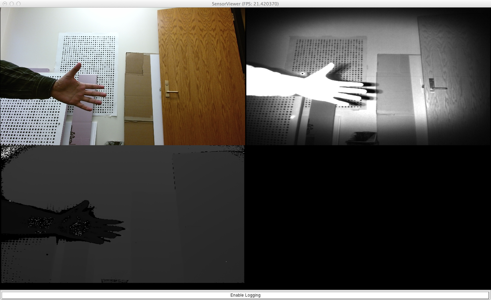

# ARPG Software Installation Notes
## Mac OS X Mavericks 10.9.4

This guide describes how to install the ARPG software used for calibration and 3D reconstruction on Mac OS X Mavericks 10.9.4. It encompasses:
* Common dependencies: CUDA, Gflags, Glog, Eigen3, Ceres Solved, Google Protobuf, OpenCV.
* Common ARPG utilities: Sophus, CVars, Pangolin, SceneGraph.
* Calibu: Calibration library.
* Libfreenect2: Open source driver for Kinect2.
* Node: Network communication library.
* HAL: Hardware abstraction layer for device access.
* Vicalib: Visual-inertia calibration application.
* Kangaroo: CUDA wrapper that implements Kinect Fusion.
* Example applications to test the installation.
* Additional documentation.

## Notes

### Clang vs GCC

You can use either Clang or GCC as C/C++ compilers. As general advice, use GCC if you need CUDA (e.g. for Kangaroo), and Clang otherwise. You must take this notes into account before choosing one:

1. You can't mix libraries compiled by different compilers unless you make they use the same standard library implementation.
2. GCC uses `libstdc++` and Clang `libc++` (it used `stdlibc++` before Mac OS X 10.9, see [additional information](http://stackoverflow.com/questions/19774778/when-is-it-necessary-to-use-use-the-flag-stdlib-libstdc)).
3. Clang can use `stdlibc++` by using the flag `-stdlib=libstdc++`. However, the `libstdc++` version shipped by Clang is 6.0.9, which corresponds to GCC 4.2.1 ([list of versions of GCC and stdlibc++](https://gcc.gnu.org/onlinedocs/libstdc++/manual/abi.html)). This version is old and does not have full support for C++11 (see [additional information](http://stackoverflow.com/questions/26447231/clang-does-not-recognize-stdshared-ptr-with-libstdc)).
4. If you use Homebrew or MacPorts as package managers, take into account that they may use Clang by default.
5. The compiler used by default is `/usr/bin/cc` and `/usr/bin/c++`, which are links to the real compiler binaries. You can modify them to change the default compiler of the system. To check the compiler version, you can do:

        $ cc --version
        $ c++ --version

## Common dependencies

### Basic

Dependencies common to most of the libraries:
* CMake 2.8 with ccmake,
* Eigen3,
* Optioanlly, GCC 4.6 (a higher version can be used, although it takes some time for us to confirm compatibility with the bleeding edge).

The usual way to build a library or application that supports CMake (contains a `CMakeLists.txt` file) is as following:

    $ cd library # the directory that contains the main CMakeLists.txt file
    $ mkdir build
    $ cd build
    $ ccmake .. # set compilation options, [c]onfigure and [g]enerate
    $ make
    $ make install

### ARPG dependencies

#### CUDA
CUDA <= 7.0 is required by Kangaroo, and you may also use it for OpenCV.

1. Install CUDA for nVidia graphic cards from https://developer.nvidia.com/cuda-downloads?sid=625109.
2. Get the latest thrust library from https://github.com/thrust/thrust and copy the thrust directory to `/usr/local/cuda/include`.
3. Optionally, install gcc4.6 if you are going to use GCC. If you use Homebrew:

        $ brew install gcc46

#### Eigen

1. Get and install Eigen from http://eigen.tuxfamily.org/index.php?title=Main_Page.

#### GFlags

1. Get and install Gflags from https://code.google.com/p/gflags/ or using your system's package management software.
2. For version >= 2.1.1, in ccmake set variable `GFLAGS_NAMESPACE=google`.

#### Glog

1. Get and install Glog from https://code.google.com/p/google-glog/ or using your system's package management software.
2. Set environment variable `GLOG_logtostderr=1`. For example, in `~/.bash_profile`:

        export GLOG_logtostderr=1

#### Ceres Solver

1. Get and install Ceres Solver from http://ceres-solver.org/ or using your system's package management software.
2. If you get any error similar to this:

        ceres-solver/examples/libmv_bundle_adjuster.cc:300:58: error: 'read' was not declared in this scope
        CHECK_GT(read(file_descriptor_, &value, sizeof(value)), 0);

  open file `ceres-solver/examples/libmv_bundle_adjuster.cc` and add `# include <unistd.h>` to line 103:

       #ifdef _MSC_VER
       #  include <io.h>
       #  define open _open
       #  define close _close
       typedef unsigned __int32 uint32_t;
       #else
       # include <stdint.h>
       # include <unistd.h>

       // O_BINARY is not defined on unix like platforms, as there is no
       // difference between binary and text files.
       #define O_BINARY 0

       #endif

#### Google Protocol Buffers

1. Get and install Protocol Buffers from https://github.com/google/protobuf/ or using your system's package management software.
2. If you use GCC and get a linking error as this one:

        dyld: Symbol not found: __ZNSt3tr18__detail12__prime_listE
        Referenced from: protobuf/src/.libs/libprotobuf.9.dylib
        Expected in: /usr/lib/libstdc++.6.dylib
        in protobuf/src/.libs/libprotobuf.9.dylib

  Make sure you are not using an old `libstdc++` (e.g. libstdc++.6.0.9 provided by Clang by default). A fast trick to use a newer version is to add to `DYLD_LIBRARY_PATH` the path to the newer `libstdc++`. For example, for gcc 4.8.2 installed by Homebrew:

       $ export DYLD_LIBRARY_PATH="/usr/local/Cellar/gcc/4.8.2_1/lib/gcc/x86_64-apple-darwin13.2.0/4.8.2/:$DYLD_LIBRARY_PATH"
       $ ./configure CC=/usr/local/bin/gcc CXX=/usr/local/bin/g++
       $ make
You will have to add the `export` instruction before executing any program that uses `protobuf`, or permanently by using for example `~/.bash_profile`.

#### OpenCV

1. Get an install OpenCV from http://opencv.org/downloads.html or using your system's package management software.
2. Make sure variable `CUDA_HOST_COMPILER` is set either to gcc-4.6 or clang (and not just gcc or cc).
3. If OpenCV version is 2.4.9 and you get this error

        ld: warning: directory not found for option '-L-Wl,/usr/local/cuda'
        ld: can't map file, errno=22 file '/usr/local/cuda' for architecture x86_64
        
  go to `opencv/cmake/FindCUDA.cmake` and change line

        list(APPEND CUDA_LIBRARIES -Wl,-rpath "-Wl,${_cuda_path_to_cudart}"
        
  for

        list(APPEND CUDA_LIBRARIES -Wl,-rpath "${_cuda_path_to_cudart}".
        
  You may need to do the same in the system CMake modules, for example in `/usr/local/share/cmake-3.0/Modules/FindCUDA.cmake`. See [additional information](
http://answers.opencv.org/question/33972/problems-with-249-and-os-x-1085/).

4. There is a known bug in OpenCV 2.4.9 when compiled with CUDA 6.5. If you get this error:

        opencv-2.4.9/modules/gpu/src/nvidia/core/NCVPixelOperations.hpp(51): error: a storage class is not allowed in an explicit specialization

  try replacing file [NCVPixelOperations.hpp](
http://code.opencv.org/projects/opencv/repository/revisions/feb74b125d7923c0bc11054b66863e1e9f753141) in OpenCV.

5. The default OpenCV `highgui` module uses Cocoa as rendering framework by default. This module uses Objective C++ 2 syntax that is not supported by gcc <= 4.8, causing errors as these:

        [ 20%] Building CXX object modules/highgui/CMakeFiles/opencv_highgui.dir/src/window_cocoa.mm.o
        opencv-2.4.9/modules/highgui/src/window_cocoa.mm: In function 'void cvDestroyAllWindows()':
        opencv-2.4.9/modules/highgui/src/window_cocoa.mm:200:23: error: expected ';' before 'in'
        for(NSString *key in list) {

  Similar problems occur even using alternatives Carbon or Qt. To solve this, you have to use Clang with `-stdlib=libstdc++`, or to disable the highgui module.

#### ZeroMQ C++ API
Note this issue: https://github.com/zeromq/zmqpp/issues/164.
        $ git@github.com:zeromq/zmqpp.git
        $ mkdir -p builds/zmqpp; cd builds/zmqpp; cmake ../../zmqpp; make; cd -

#### OSXGlut
1. Optionally, you can install OSXGlut from https://github.com/stevenlovegrove/osxglut.

## Common ARPG utilities

#### Sophus
        $ git clone git@github.com:arpg/Sophus.git
        $ mkdir -p builds/Sophus; cd builds/Sophus; cmake ../../Sophus; make; make install; cd -

#### CVars (GLConsole)
        $ git clone git@github.com:arpg/CVars.git
        $ mkdir -p builds/CVars; cd builds/CVars; cmake ../../CVars; make; make install; cd -

#### Pangolin
        $ git clone git@github.com:arpg/Pangolin.git
        $ mkdir -p builds/Pangolin; cd builds/Pangolin; cmake ../../Pangolin; make; make install; cd -

#### SceneGraph
        $ git clone git@github.com:arpg/SceneGraph.git
        $ mkdir -p builds/SceneGraph; cd builds/SceneGraph; cmake ../../SceneGraph; make; make install; cd -

#### Calibu
        $ git clone git@github.com:arpg/Calibu.git
        $ mkdir -p builds/Calibu; cd builds/Calibu; cmake ../../Calibu; make; make install; cd -

#### Node
        $ git clone https://github.com/arpg/Node
        $ mkdir -p builds/Node; cd builds/Node; cmake ../../Node; make; make install; cd -

#### libfreenect2
Install this library if you require support for Kinect2.

1. Get libfreenect2 from https://github.com/OpenKinect/libfreenect2.
2. Follow compilation instructions in that website (install and compile dependencies). *If you are on OS X,* when running CMake for libfreenect2 it is recommended you pass the flag `-DENABLE_OPENGL=OFF` in order to bypass bug https://github.com/OpenKinect/libfreenect2/issues/31.

#### HAL
        $ git clone https://github.com/arpg/HAL
        $ mkdir -p builds/HAL; cd builds/HAL; cmake ../../HAL; make; make install; cd -
##### Gladiator Landmark IMU on MacOS
To support this IMU with the CP2102 dongle, install the Mac CP2102 drivers from:
https://www.silabs.com/products/mcu/Pages/USBtoUARTBridgeVCPDrivers.aspx

Enable the driver in the HAL build by defining BUILD_Gladiator_Imu

To run, specify the port in the URI: gladiator:[port=/dev/cu.SLAB_USBtoUART]//

The kernel driver on Mac doesn't close the port properly when an application segfaults - you may need to unplug and replug the serial dongle to restore operation.

#### arpg_apps
        $ git clone https://github.com/arpg/arpg_apps
        $ mkdir -p builds/arpg_apps; cd builds/arpg_apps; cmake ../../arpg_apps; make; cd -

#### Vicalib
1. Get Vicalib from https://github.com/arpg/vicalib
2. ccmake and make install normally.
3. If you compile with Clang and get errors saying that `shared_ptr` does not belong to `std::`, probably your `libstdc++` implementation is old (e.g. version 6.0.9 shipped with GCC 4.2.1) and you should update it. Alternatively, use GCC to build Vicalib.

#### Kangaroo

1. Get Kangaroo from https://github.com/arpg/Kangaroo.
2. Run ccmake on the Kangaroo source directory and set `BUILD_APPLICATIONS=OFF`.
3. Make sure you set variable `CUDA_HOST_COMPILER` as desired.
4. Make and `make install` (with `sudo` if required).
5. If you get an error that looks like this:

        In file included from /usr/local/cuda/include/thrust/iterator/iterator_traits.h:75:
        /usr/local/cuda/include/thrust/iterator/detail/iterator_traits.inl:60:53:
        error: no type named 'iterator_category' in 'thrust::iterator_traits<thrust::device_ptr<void> >' typename thrust::iterator_traits<Iterator>::iterator_category
  make sure you got the latest version of the thrust library from https://github.com/thrust/thrust and copy its headers to `/usr/local/cuda/include/thrust`.
  
##### Using CUDA
If you need Kangaroo with CUDA:

1. Kangaroo requires a CUDA version >= 7.0.
2. If you use GCC, it has been observed that CUDA works with GCC 4.6 but it does not with higher versions (4.7 or 4.8).  Other libraries can use higher versions of GCC.
3. For libraries that use CMake as building system, the compiler can be set during the configuration (running `ccmake`, after [t]oggling advanced mode). You are likely to set one of these sets of variables:

  Clang with `libstdc++`:
  * `CMAKE_CXX_COMPILER=/usr/bin/c++`
  * `CMAKE_CXX_FLAGS=-stdlib=libstdc++`
  * `CMAKE_C_COMPILER=/usr/bin/cc`
  * `CUDA_HOST_COMPILER=/usr/bin/clang`

  GCC:
  * `CMAKE_CXX_COMPILER=/usr/local/bin/g++`
  * `CMAKE_C_COMPILER=/usr/local/bin/gcc`
  * `CUDA_HOST_COMPILER=/usr/local/bin/gcc-4.6`

  Notes:
    * We are assuming that gcc is installed in `/usr/local/bin/gcc-4.6` and that there exist symbolic links `/usr/local/bin/gcc` and `/usr/local/bin/g++`. If these are not the paths in your system, please change them.
    * Variable `CUDA_HOST_COMPILER` only appears in libraries that use CUDA.
    * `CUDA_HOST_COMPILER` cannot be the path to a symbolic link, but a path to a binary.
    * In ccmake, after the configuration step, the `CUDA_HOST_COMPILER` value may have changed to the same value as `CMAKE_C_COMPILER`. Make sure it contains the correct path before generating the makefiles.

## Example applications

### SensorViewer

You can test if HAL, libfreenect2 and arpg_apps are correctly installed by using `SensorViewer` with a Kinect2 camera. Run:

        $ cd arpg_apps/build/Applications/SensorViewer
        $ ./SensorViewer -cam convert:[fmt=RGB8,range=10000]//freenect2:[rgb=1,ir=1,depth=1]//

You will see the RGB, infrared and depth live images:

If you get a Segmentation Fault, make sure you compiled libfreenect2 with the correct version of the `CUDA_HOST_COMPILER` (gcc4.6 for GCC).

To make Kinect2 work, the camera must appear as a USB 3.0 device under the USB 3.0 SuperSpeed Bus in the System Information application, in the USB section under Hardware.
If it appears under USB 3.0 Hi-Speed Bus, it will not work (this is USB 2.0 actually).
It has been observed that Mac only recognizes a Kinect2 camera as a USB 3.0 device after following these steps:

1. Plug the USB cable from the camera to the computer first.
2. Plug the camera to the power then.

## Additional documentation

* [How to install libfreenect2 for Kinect2 on Windows 8.1](https://github.com/OpenKinect/libfreenect2/issues/105)
